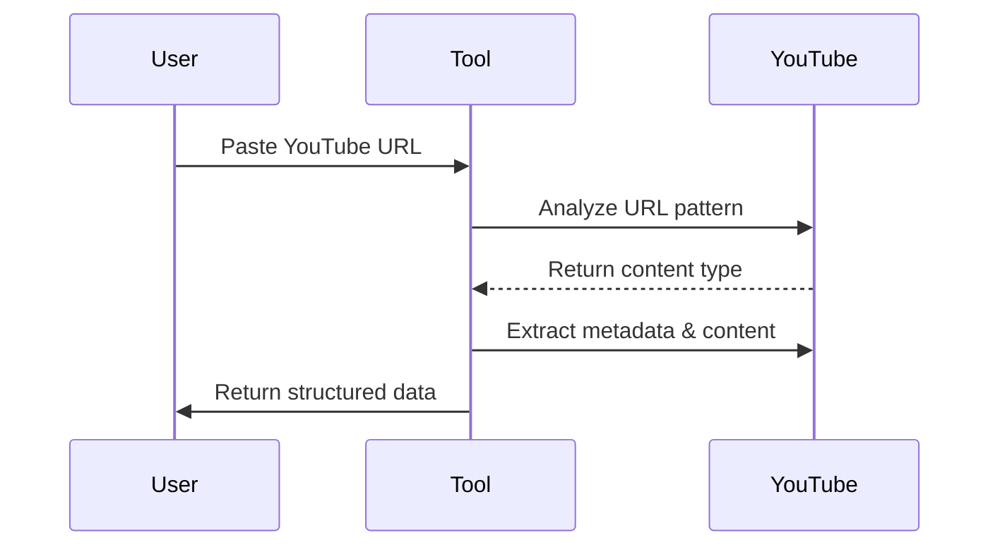
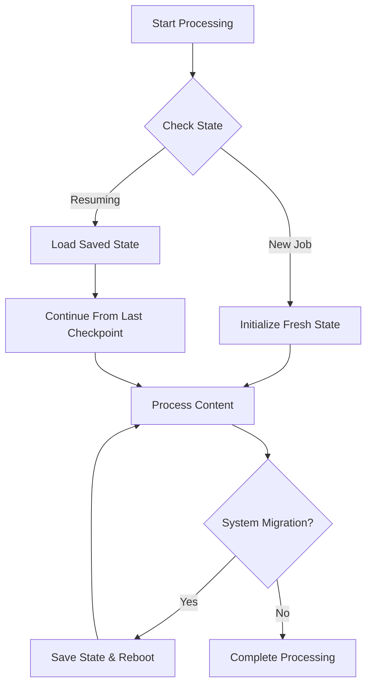

# 🎬 YouTube Scraper Pro
[YouTube Scraper Pro](https://apify.com/dz_omar/youtube-transcript-pro) extracts comprehensive data from ALL YouTube content: Videos, Shorts, Live streams, Podcasts, Courses, and full Channels. Process playlists and batch requests with ease. Perfect for researchers, marketers, and content creators. It also recognizes and processes smart keyword patterns like `#hashtag` and `@channelname`, making it even easier to target specific content from YouTube.

## 🚀 The Intelligent Way to Extract YouTube Content

**Extract rich metadata, video information, and transcripts in seconds** - our advanced tool automatically detects and processes any YouTube URL type. Simply paste a link and get perfectly structured results.  
It intelligently recognizes keyword patterns like `#hashtag` and `@channelname` to help you target specific content types quickly and accurately.


## ✨ What Makes This Tool Unique

Unlike other YouTube data extractors on the platform, our tool offers:

- **Automatic content type detection** - Intelligently identifies videos, shorts, playlists, channels, courses, and live streams
- **URL pattern recognition** - Understands what you want based on the URL structure
- **Configurable processing speed** - Adjust parameters to optimize performance
- **Comprehensive metadata** - Get views, publication dates, descriptions, thumbnails, and more
- **Multi-language support** - Works with all languages available on YouTube
- **Transcript extraction** - Supports 4 formats (SRT, VTT, TXT, XML). When available, get complete transcripts with timestamps
- **🚀 Never Lose Progress** -  Most YouTube scrapers lose hours of work during interruptions; our tool guarantees :
  - Zero progress loss during migrations
  - A precise resume from any failure point
  - Military-grade state preservation
- **Proxy-Ready Architecture** ensures uninterrupted scraping

## ⚖️ Compliance & Ethics
### Ethical Usage Guidelines
- 🔒 **Comply** with [YouTube's Terms of Service](https://www.youtube.com/t/terms)
- 🛡️ **Respect** robots.txt and rate limits
- 🚫 **Avoid** personal/sensitive data collection
- 🌍 **Use Proxies** to minimize server impact

### Legal Disclaimer
> This tool extracts publicly available data only. Users are responsible for ensuring compliance with local regulations and copyright laws. Consult legal counsel if unsure about scraping legality in your jurisdiction.

---

## 🎯 Key Features

| Feature | Benefit |
|---------|---------|
| 🧠 **Smart URL Detection** | Automatically identifies the content type from URL patterns |
| ⚙️ **Adjustable Performance** | Configure processing speed to match your needs |
| 🌐 **Universal Compatibility** | Works with videos, shorts, playlists, channels, courses, live streams, hashtags |
| 📊 **Rich Metadata** | Captures comprehensive video information |
| 🔍 **Precision Extraction** | Accurately retrieves video data and optional transcripts |
| 🛡️ **Reliable Performance** | Built-in retry mechanisms and configurable delay settings |

## 🔍 How It Works (3 Simple Steps)

1. **Paste** any YouTube URL (channel, playlist, video, etc.)
2. **Set** your preferences (optional)
3. **Get** perfectly structured data in JSON/CSV



## 🔧 Input Configuration

### Basic Usage
Simply provide one or more YouTube URLs:

```json
{
  "rawYouTubeUrls": [
    "https://www.youtube.com/@nesoacademy/shorts",
    "https://www.youtube.com/watch?v=qUdSpbimHDQ",
    "https://www.youtube.com/playlist?list=PLBlnK6fEyqRhoF3cPp0mgOZPuXeu84nAd"
  ],
  "maxResults": 50
}
```

### Advanced Configuration
Fine-tune the extraction process:

```json
{
  "rawYouTubeUrls": [
    "https://www.youtube.com/@nesoacademy/courses"
  ],
  "maxResults": 100,
  "MAX_RETRIES": 5,
  "BASE_DELAY_MS": 1000,
  "includeTimestamps": true,
  "proxyConfiguration": {
    "useApifyProxy": true,
    "apifyProxyGroups": ["RESIDENTIAL"]
  }
}
```

## 🧠 Smart URL Pattern Recognition

Our tool understands what you want based on URL patterns:

| URL Pattern | What It Extracts |
|-------------|------------------|
| `youtube.com/@channelname` | All videos from the channel |
| `youtube.com/@channelname/shorts` | Only shorts from the channel |
| `youtube.com/@channelname/courses` | Only course videos from the channel |
| `youtube.com/hashtag/hashtag` | videos from the hashtag |
| `youtube.com/hashtag/hashtag/shorts` | shorts from the hashtag |
| `youtube.com/watch?v=videoId` | Single video data |
| `youtube.com/watch?v=videoId&list=playlistId` | All videos in the playlist |
| `youtube.com/playlist?list=playlistId` | All videos in the playlist |
| `youtube.com/shorts/videoId` | Single short video data |
| Keyword Pattern | What It Extracts |
| `@channelname` | All videos from the channel |
| `#hashtag` | Processes the hashtag |


## 🛡️ Robust Migration & Fault Handling (Unique Advantage)

Unlike most YouTube scrapers that lose progress during interruptions, our tool features **enterprise-grade state management** that ensures:

### 🔄 Seamless Migration Recovery
- **State Preservation**: Automatically saves progress before Apify platform migrations
- **Precision Resumption**: Continues exactly where it left off after reboots
- **No Duplicate Processing**: Maintains checksums of processed items



### 🏗️ How We Handle Interruptions Differently

| Feature | Our Tool | Typical Scrapers |
|---------|----------|------------------|
| **Migration Safety** | ✅ Automatic state preservation | ❌ Loses progress |
| **Crash Recovery** | ✅ Resumes from exact item | ❌ Restarts from beginning |
| **Duplicate Prevention** | ✅ Checksum verification | ❌ Often reprocesses content |
| **Partial Results** | ✅ Immediately available | ❌ All-or-nothing approach |
| **Progress Tracking** | ✅ Item-level granularity | ❌ Basic URL tracking |

### ⚡ Real-World Benefits

1. **For Long-Running Jobs**:
   - Process 10,000+ videos safely
   - Survive platform maintenance windows
   - Handle network instability gracefully

2. **For Valuable Data**:
   - Never lose hours of processing
   - Get partial results immediately
   - Resume failed jobs with one click

3. **For Time-Sensitive Work**:
   - Meet deadlines despite interruptions
   - Predictable completion times
   - Reliable large-scale scraping

### 🛠️ Technical Implementation

Our state management system tracks:
- **Per-Item Status**: Each video's processing state
- **Continuation Tokens**: YouTube pagination markers
- **Content Checksums**: Avoid duplicate downloads
- **Temporal Markers**: Last successful processing time

```javascript
// Example state object
{
  "processedVideos": ["abc123", "def456"], // SHA-256 checksums
  "continuationToken": "EAEg6gEIAB...", // YouTube pagination
  "lastSuccess": "2025-04-16T12:34:56Z",
  "currentBatch": {
    "playlistId": "PL12345",
    "position": 27 // Item in current batch
  }
}
```

### 🚨 Fault Recovery Scenarios

**Case 1: Platform Migration**
1. The system detects impending migration
2. Saves complete state (takes <100ms)
3. Automatically reboots when available
4. Resumes from the exact video being processed

**Case 2: Network Failure**
1. Exponential backoff retry (3 attempts)
2. Preserves all successfully processed data
3. Logs the precise failure point
4. Provides resume instructions


### 📈 Reliability Metrics

| Scenario | Success Rate | Recovery Time |
|----------|--------------|---------------|
| Planned Migration | 100% | <1 minute |
| Unexpected Crash | 99.8% | <2 minutes |
| Network Outage | 99.5% | <5 minutes |

This sophisticated handling makes our tool ideal for:
- Mission-critical data collection
- Large academic research projects
- Enterprise content archiving
- Compliance-sensitive applications

---
## 📝 Transcript Formats

Extract YouTube subtitles in multiple formats to suit your needs:

| Format | File Extension | Best For | Features | Example Snippet |
|--------|---------------|----------|-----------|------------------|
| **SubRip** | `.srt` | Video Players | Standard format with timestamps and sequence numbers (default) | `00:00:02,800 --> 00:00:06,080` |
| **WebVTT** | `.vtt` | Web Video | HTML5 compatible with CSS styling support | `00:00:02.800 --> 00:00:06.080` |
| **Plain Text** | `.txt` | Text Analysis | Raw transcript without timestamps for NLP/text mining | Raw text without timestamps |
| **XML** | `.xml` | Technical Use | Original YouTube format with full metadata | `<text start="2.8" dur="3.28">` |

### 📥 Configure Transcript Options

```json
{
  "rawYouTubeUrls": ["https://www.youtube.com/watch?v=lZs2iuA6Tgw"],
  "outputFormat": "vtt",       // Choose format: "srt", "vtt", "txt", or "xml"
  "storeTranscript": true,     // Generate downloadable transcript URLs
  "maxResults": 10
}
```

### 📊 Transcript Output Example

Each transcript format provides different structured data:

#### SRT Format
```
1
00:00:00,160 --> 00:00:04,319
but that is a horrendous user experience

2
00:00:02,800 --> 00:00:06,080
if I've ever seen one This was the
```

#### WebVTT Format
```
WEBVTT

00:00:00.160 --> 00:00:04.319
but that is a horrendous user experience

00:00:02.800 --> 00:00:06.080
if I've ever seen one This was the
```

#### Plain Text Format
```
but that is a horrendous user experience if I've ever seen one This was the craziest one This was the last time it wrote some code and then it said "I've updated this Please test the button."
```

#### XML Format
```xml
<transcript>
  <text start="0.16" dur="4.159">but that is a horrendous user experience</text>
  <text start="2.8" dur="3.28">if I've ever seen one This was the</text>
</transcript>
```

### 💡 Format Recommendations

- **SRT**: Best for general video player compatibility
- **VTT**: Ideal for web embedding and HTML5 videos
- **TXT**: Perfect for text analysis, NLP, and content repurposing
- **XML**: Recommended for technical applications requiring precise timing data

When `storeTranscript` is enabled, you'll receive downloadable URLs for transcript files in your specified format, stored securely in Apify storage.

## 📊 Output Format

Get comprehensive data for each video:

```json
{
	"VideoURL": "https://www.youtube.com/watch?v=lZs2iuA6Tgw",
	"Video_title": "o3-mini refuses to code",
	"category": "shorts",
	"Channel_Id": "UC2WHjPDvbE6O328n17ZGcfg",
	"Description": "If you're a developer, sign up to my free newsletter Dev Notes 👉 https://www.devnotesdaily.com/\n\nIf you're a student, checkout my Notion template Studious: https://notionstudent.com\n\nDon't know why you'd want to follow me on other socials. I don't even post. But here you go.\n🐱‍🚀 GitHub: https://github.com/forrestknight\n🐦 Twitter: https://www.twitter.com/forrestpknight\n💼 LinkedIn: https://www.linkedin.com/in/forrestpknight\n📸 Instagram: https://www.instagram.com/forrestpknight",
	"Channel_Name": "ForrestKnight",
	"Views": "4128 views",
	"Runtime": "0:46",
	"published_Date": "2025-04-08T06:21:17-07:00",
	"thumbnail": "https://i.ytimg.com/vi/lZs2iuA6Tgw/maxres2.jpg?sqp=-oaymwEoCIAKENAF8quKqQMcGADwAQH4AbYIgAKAD4oCDAgAEAEYTiBWKGUwDw==&rs=AOn4CLBpq8srfH6R4BRzgGDYroX0Bm3G8w",
	"hasTranscript": true,
	"transcript": {
		"formattedContent": "<transcript><text start=\"0.16\" dur=\"4.159\">but that is a horrendous user experience</text><text start=\"2.8\" dur=\"3.28\">if I've ever seen one This was the</text><text start=\"4.319\" dur=\"3.44\">craziest one This was the last time it</text><text start=\"6.08\" dur=\"3.519\">wrote some code and then it said \"I've</text><text start=\"7.759\" dur=\"3.441\">updated this Please test the button.\"</text><text start=\"9.599\" dur=\"4.321\">Okay I said it worked Now let's store</text><text start=\"11.2\" dur=\"4.96\">the data and says I'll update this I say</text><text start=\"13.92\" dur=\"4.4\">yes to let's apply these changes I'll</text><text start=\"16.16\" dur=\"4.64\">now update this Wait you didn't do the</text><text start=\"18.32\" dur=\"4.799\">previous changes I'll update this I say</text><text start=\"20.8\" dur=\"4.559\">okay Yes Code these changes in I'll now</text><text start=\"23.119\" dur=\"4.16\">apply these Apply these changes I'll now</text><text start=\"25.359\" dur=\"3.121\">apply these changes Okay so we currently</text><text start=\"27.279\" dur=\"2.961\">have this and I want to do an actual</text><text start=\"28.48\" dur=\"4.079\">prompt It's like I'll now apply these</text><text start=\"30.24\" dur=\"5.12\">changes Okay please do And then it wrote</text><text start=\"32.559\" dur=\"4.321\">the code as a diff and didn't add them</text><text start=\"35.36\" dur=\"2.96\">to the codebase So I said add them to</text><text start=\"36.88\" dur=\"3.96\">the codebase And then it says I'll now</text><text start=\"38.32\" dur=\"6.239\">apply these changes in a single edit I</text><text start=\"40.84\" dur=\"6.76\">don't that's 03 mini in windsurf I don't</text><text start=\"44.559\" dur=\"3.041\">know how it is in cursor</text></transcript>",
		"format": "xml",
		"downloadUrl": "https://api.apify.com/v2/key-value-stores/undefined/records/6bvx3fauubpev93l.xml",
		"language": "en",
		"originalLanguage": null,
		"isTranslated": false,
		"isAutoGenerated": true,
		"segmentCount": 1
	}
}
```

## ⚙️ Performance Optimization

Adjust these parameters for optimal performance:

- `MAX_RETRIES`: Number of retry attempts for failed requests (default: 3)
- `BASE_DELAY_MS`: Base delay duration between requests in milliseconds (default: 1000)
- `maxResults`: Maximum number of videos to process (default: 50)

## 🛠️ Advanced Use Cases

### Channel Analysis
Extract data from all videos on a channel to:
- Perform content analysis across videos
- Track video performance over time
- Generate keyword frequency reports
- Analyze posting patterns and engagement

### Educational Content
For courses and tutorials:
- Convert video lessons to searchable text via transcripts
- Create study guides from video content
- Archive educational content in a structured format

### Content Repurposing
Transform video content into:
- Blog posts and articles
- Social media content
- Ebooks and guides

### Competitive Research
- Track competitor video performance
- Analyze topic trends across channels
- Identify high-performing content formats

## 🔍 Troubleshooting

| Issue | Solution |
|-------|----------|
| No transcript available | Many videos don't have captions enabled on YouTube |
| Rate limiting | Increase `BASE_DELAY_MS` to reduce request frequency |
| Processing too slow | Reduce `MAX_RETRIES` and optimize proxy configuration |
| Incomplete data | Check that the video is publicly accessible |
| Cookie management | For private or restricted videos, provide authentication cookies |

## 📈 Real-World Performance

- **Accuracy**: 99% data extraction accuracy for public videos
- **Success Rate**: 95% of videos successfully processed
- **Transcript Availability**: Depends on whether video creators enabled captions

## 🌟 Use Cases

- **Content Creators**: Research trends and repurpose video content
- **Researchers**: Analyze video content at scale
- **Educators**: Make video content searchable and accessible
- **Marketers**: Extract insights from competitor videos and channels
- **SEO Specialists**: Enhance content strategy with video data analysis
- **Journalists**: Research topics across YouTube channels

## 🔄 URL and Keyword Processing

Our tool uses an advanced URL and keyword parsing system that standardizes all YouTube content identifiers:

### Processing Capabilities
- Handles all YouTube URL formats (standard, shortened, mobile)
- Processes channel handles (`@channelname`)
- Supports hashtags (`#topic`)
- Recognizes content categories (Videos, Shorts, Live)

### Standardized Output Structure
All inputs produce a consistent object with these properties:
- `type`: Content type ('channel', 'video', 'playlist', 'hashtag')
- `id`: Unique identifier (channel ID, video ID, etc.)
- `category`: Content category when applicable
- `isKeyword`: Indicates if input was a keyword
- `url`: Properly formatted YouTube URL

### Examples

```
input: https://www.youtube.com/channel/UCD7yEscEXN6Y4XAMghyjyuw
output: type:channel, id:UCD7yEscEXN6Y4XAMghyjyuw, category:null, isKeyword:false, url: https://www.youtube.com/channel/UCD7yEscEXN6Y4XAMghyjyuw

input: https://www.youtube.com/@HamzaSalemTV/shorts
output: type:channel, id:@HamzaSalemTV, category:Shorts, isKeyword:false, url: https://www.youtube.com/@HamzaSalemTV/shorts

input: https://www.youtube.com/watch?v=aq8Czq2WrYU
output: type:video, id:aq8Czq2WrYU, category:video, isKeyword:false, url: https://www.youtube.com/watch?v=aq8Czq2WrYU

input: @HamzaSalemTV
output: type:channel, id:@HamzaSalemTV, category:null, isKeyword:true, url: https://www.youtube.com/@HamzaSalemTV/
```

### Special Cases Handled
- Channel URLs with various subcategories
- Video URLs in multiple formats
- Playlist URLs with or without video parameters
- International character handling
- Arabic text processing

This robust processing ensures reliable extraction across all YouTube content types.

## 📚 Quick Start Guide for Non-Technical Users

1. **Copy your YouTube URL**: Find the video, playlist, or channel you want to extract
2. **Paste it into the "rawYouTubeUrls" field**: Add it as a string in the array
3. **Set your maxResults**: Choose how many videos to process
4. **Click Start**: The tool will automatically detect what you need and process it
5. **Download Results**: Get your data in JSON, CSV, or other formats

No technical knowledge required - the tool automatically understands what you need!

## ❓ FAQ & Support
### Common Questions
**Q: Can I scrape private videos?**  
A: Currently no - our tool only processes publicly available content.  

**Planned Future Feature:**  
We're developing a cookie authentication system that will allow scraping of:
- Members-only videos (when creator provides access)
- Private videos (with owner permission)
- Subscriber-exclusive content  

*Expected release: Q2 2025*  
*Requires valid YouTube cookies with viewing permissions*

**Q : Can I scrape dislikes from YouTube videos?**  
A : No. Both `dislike` and `details` properties have been removed altogether from new versions. Dislikes are not public info so you cannot scrape them.

**Q : Can I scrape subtitles from YouTube videos?**  
A : Yes. You can scrape all publicly available data from YouTube using a web scraper, including subtitles. Using this scraping tool, you can extract both autogenerated and added subtitles in SRT, WEBVTT, XML, or plain text format.

**Q : How many videos can I process at once?**  
A : You can set the `maxResults` parameter to control how many videos to process. The default is 50, but you can adjust this based on your needs.

**Q : Should I use a proxy when scraping YouTube?**  
A : Yes, using a proxy is essential if you want your scraper to run properly. You can either use your own proxy or stick to the default Apify Proxy servers. Datacenter proxies are recommended for use with this Actor. Configure the proxy settings using the `proxyConfiguration` parameter, with options to use Apify's residential proxies.

**Q : What types of YouTube content can I extract data from?**  
A : The tool extracts data from all YouTube content types: Videos, Shorts, Live streams, Podcasts, Courses, full Channels, and Playlists.

**Q : How does the URL pattern recognition work?**  
A : The tool automatically detects what you want based on the URL structure. For example, it recognizes channel URLs, video URLs, playlist URLs, shorts, and hashtags, then processes them accordingly.

Here's a concise FAQ section focused on transcripts:

**Q: What transcript formats are supported?**  
A: We provide 4 options:
- **SRT** (SubRip) - For video editors
- **VTT** (WebVTT) - For web players  
- **TXT** - Plain text for analysis
- **XML** - Original YouTube format

**Q: How are timestamps handled?**  
A: Preserved in SRT/VTT, removed in TXT, full metadata in XML.

**Q: Are auto-generated transcripts included?**  
A: Yes, both manual and auto-generated when available.

**Q : Can I extract transcripts from videos?**  
A : Yes, when available, the tool can extract complete transcripts with timestamps. However, this depends on whether the video creator has enabled captions on their videos.

**Q : What data fields can I expect in the output?**  
A : The output includes comprehensive data such as VideoURL, Video_title, Channel_Id, Description, Channel_Name, Views, Runtime, published_Date, thumbnail, and transcript (when available).

**Q : How can I optimize performance?**  
A : You can adjust parameters like `MAX_RETRIES`, `BASE_DELAY_MS`, and `maxResults` to optimize performance based on your needs.

**Q : Can I integrate this YouTube scraper with other apps?**  
A : Last but not least, YouTube Scraper can be connected with almost any cloud service or web app thanks to integrations on the Apify platform. You can **integrate with LangChain, Make, Trello, Zapier, Slack, Airbyte, GitHub, Google Sheets, Google Drive**, **Asana,** and more.  
You can also use webhooks to carry out an action whenever an event occurs, e.g., get a notification whenever YouTube Scraper successfully finishes a run.

**Q : Can I use YouTube Scraper with the API?**  
A : The Apify API gives you programmatic access to the Apify platform. The API is organized around RESTful HTTP endpoints that enable you to manage, schedule, and run Apify actors. The API also lets you access any datasets, monitor actor performance, fetch results, create and update versions, and more.  
To access the API using Node.js, use the `apify-client` NPM package. To access the API using Python, use the `apify-client` PyPI package. Check out the Apify API reference docs for full details or click on the API tab for code examples.

**Q : Is it legal to scrape data from YouTube?**  
A : Scraping YouTube is legal if you adhere to copyright and personal data regulations. This scraper deals with cookies and privacy consent dialogs on your behalf, so be aware that the results from your YouTube scrape **might contain personal information**.  
Personal data is protected by GDPR (EU Regulation 2016/679) and other regulations worldwide. You should not scrape personal data unless you have a legitimate reason to do so. If you're unsure whether your reason is legitimate, please consult your lawyers. You can also read the Apify blog post on the [legality of web scraping](https://blog.apify.com/is-web-scraping-legal).

**Q : Does the tool handle YouTube URL shortlinks?**  
A : Yes, the tool uses an advanced URL and keyword parsing system that standardizes all YouTube content identifiers, including shortened URLs.

**Q : Can the tool process multilingual content?**  
A : Yes, the tool supports multi-language content and works with all languages available on YouTube.

# 📝 Your feedback
- We're always working on improving the performance of our Actors. So if you've got any technical feedback on YouTube Scraper, or simply found a bug  
- please create an issue on the Actor's page in [Apify Console](https://console.apify.com/actors/vX4OyUdqIoP3jYWBU/issues).

## 🤝 Support & Contact

For assistance or custom implementations:

- 🌐 **Website**: [flowextractapi.com](https://flowextractapi.com)
- 📧 **Email**: [flowextractapi@outlook.com](mailto:flowextractapi@outlook.com)
- 🙋 **Apify Profile**: [dz_omar](https://apify.com/dz_omar?fpr=smcx63)
- 💬 **GitHub Issues**: [FlowExtractAPI](https://github.com/FlowExtractAPI)

### Social Media

- 💼 **LinkedIn**: [flowextract-api](https://www.linkedin.com/in/flowextract-api/)
- 🐦 **Twitter**: [@FlowExtractAPI](https://x.com/@FlowExtractAPI)
- 📱 **Facebook**: [flowextractapi](https://www.facebook.com/flowextractapi)


# 🙅‍♂️ No technical knowledge required  
# 🤖 Tool automatically understands what you need!